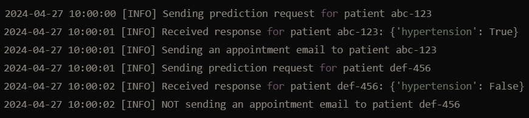

# Hypertension Prediction

**Hypertension Risk Prediction with Machine Learning for Preventive Interventions.**


## Problem Description

Hypertension, commonly referred to as high blood pressure, is a pervasive and silent health condition that affects millions of individuals worldwide. Characterized by the persistent elevation of blood pressure in the arteries, hypertension serves as a significant risk factor for a multitude of severe health issues, including heart diseases, strokes, kidney failure, and other vascular complications. According to the World Health Organization (WHO), hypertension is responsible for approximately 7.5 million deaths each year, making it one of the leading causes of mortality globally.

Despite its widespread prevalence, hypertension often remains undetected in its early stages due to its asymptomatic nature. Many individuals are unaware of their high blood pressure levels until they experience a critical health event, such as a heart attack or stroke. This delayed diagnosis hampers the effectiveness of preventive measures and increases the burden on healthcare systems.

Early detection of individuals at high risk of developing hypertension is crucial for implementing timely and effective preventive interventions. Identifying these individuals allows for lifestyle modifications, medical treatments, and regular monitoring, which can significantly reduce the risk of severe complications and improve overall quality of life.

This project addresses the critical need for early hypertension detection by leveraging advanced Machine Learning (ML) techniques to develop predictive classification models. By analyzing various health parameters and demographic factors, the models aim to accurately predict the risk of hypertension in individuals. This proactive approach facilitates targeted interventions, enabling healthcare providers to prioritize resources and tailor preventive strategies to those most in need.

The dataset utilized in this project is sourced from [Kaggle](https://www.kaggle.com/datasets/prosperchuks/health-dataset?select=hypertension_data.csv) and specifically comprises the `hypertension_data.csv` file (1.09 MB). This dataset encompasses detailed information about individuals, including demographic characteristics, clinical measurements, and other health-related attributes relevant to hypertension detection. With 26,083 records and 14 variables, the dataset provides a robust foundation for training and evaluating Machine Learning models aimed at predicting hypertension risk.

By developing accurate and reliable predictive models, this project aims to empower individuals and healthcare professionals with actionable insights, ultimately contributing to the reduction of hypertension-related health risks and associated healthcare costs. The comprehensive approach, encompassing data preparation, model training, evaluation, and deployment, ensures that the developed solution is both effective and scalable for real-world applications.

## Objectives

1. **Data Preparation and Cleaning:** Ensure data quality through handling missing values, removing outliers, and transforming variables.
2. **Feature Engineering:** Create and select features that significantly contribute to hypertension prediction.
3. **Development of Predictive Models:** Train and optimize various Machine Learning models to identify the most suitable for the problem.
4. **Evaluation and Selection of the Best Model:** Use performance metrics and cross-validation to select the most effective model.
5. **Model Deployment:** Make the trained model available through an API for real-world application.
6. **Documentation and MLOps:** Implement MLOps practices to ensure reproducibility, scalability, and continuous maintenance of the model.

## Table of Contents

- [Dataset](#dataset)
  - [Description](#description)
  - [Sources](#sources)
- [Requirements](#requirements)
- [Installation](#installation)
- [Exploratory Data Analysis (EDA)](#exploratory-data-analysis-eda)
  - [Univariate Analysis](#univariate-analysis)
  - [Bivariate Analysis](#bivariate-analysis)
  - [Outlier Detection](#outlier-detection)
  - [Correlation Heatmap](#correlation-heatmap)
- [Data Preparation](#data-preparation)
  - [Handling Missing Values](#handling-missing-values)
  - [Removing Outliers](#removing-outliers)
  - [Feature Scaling](#feature-scaling)
- [Feature Engineering](#feature-engineering)
  - [Creating Categories](#creating-categories)
  - [Feature Importance Analysis](#feature-importance-analysis)
- [Model Training and Evaluation](#model-training-and-evaluation)
  - [Models Used](#models-used)
  - [Hyperparameter Tuning](#hyperparameter-tuning)
  - [Evaluation Metrics](#evaluation-metrics)
  - [Model Selection](#model-selection)
- [Model Selection and Final Evaluation](#model-selection-and-final-evaluation)
- [Threshold Analysis for Model Performance](#threshold-analysis-for-model-performance)
- [Cross-Validation Report](#cross-validation-report)
- [Save and Load the Model](#save-and-load-the-model)
- [Model Deployment](#model-deployment)
  - [Flask Web Service](#flask-web-service)
  - [Dockerization](#dockerization)
- [Testing](#testing)
  - [Test Scenario 1: Local Service](#test-scenario-1-local-service)
  - [Test Scenario 2: Dockerized Service](#test-scenario-2-dockerized-service)
- [API Usage Example](#api-usage-example)
- [Conclusion](#conclusion)
- [Contribution](#contribution)

## Dataset

### Description

The dataset used in this project contains detailed information about individuals, including demographic and health parameters. Each record describes characteristics that may influence the risk of hypertension.

- **Total Records:** 26,083
- **File Size:** 1.09 MB
- **Target Variable:** `target` (1 for hypertensive, 0 for non-hypertensive)
- **Descriptive Columns:**

| Column    | Description                                                                                      |
|-----------|--------------------------------------------------------------------------------------------------|
| age       | Age of the individual (years)                                                                    |
| sex       | Sex of the individual (0 = female, 1 = male)                                                     |
| cp        | Chest pain type (categories 0 to 3)                                                              |
| trestbps  | Resting blood pressure (mm Hg)                                                                    |
| chol      | Serum cholesterol (mg/dl)                                                                         |
| fbs       | Fasting blood sugar > 120 mg/dl (1 = true, 0 = false)                                           |
| restecg   | Resting electrocardiographic results (categories 0 to 2)                                         |
| thalach   | Maximum heart rate achieved during exercise                                                       |
| exang     | Exercise-induced angina (1 = yes, 0 = no)                                                        |
| oldpeak   | ST depression induced by exercise relative to rest                                                  |
| slope     | Slope of the peak exercise ST segment (categories 0 to 2)                                        |
| ca        | Number of major vessels colored by fluoroscopy (0 to 4)                                          |
| thal      | Fixed defect, reversible defect, or normal                                                             |
| target    | Target variable indicating the presence of hypertension (1) or absence (0)                         |

### Sources

This dataset was obtained from the [Kaggle](https://www.kaggle.com/datasets/prosperchuks/health-dataset?select=hypertension_data.csv) platform and is widely used in Machine Learning research focused on health diagnostics and predictive analyses. The original data source has been adapted for this project, ensuring privacy and compliance with ethical guidelines for using health data.

## Requirements

- **Python 3.9+**
- **Libraries:**
  - pandas
  - numpy
  - scikit-learn
  - xgboost
  - flask
  - pickle
  - matplotlib
  - seaborn
  - gunicorn
  - tqdm

## Installation

1. **Clone the Repository:**
    ```bash
    git clone git@github.com:nathadriele/machine-learning-zoomcamp.git
    cd midterm-project
    ```

2. **Create and Activate a Virtual Environment:** 
    ```bash
    python -m venv venv
    source venv/bin/activate  # On Windows: venv\Scripts\activate
    ```

3. **Install Dependencies:**
    ```bash
    pip install -r requirements.txt
    ```

## Exploratory Data Analysis (EDA) 

⚠️ **With some print examples taken from the project notebook. For all the details, access the notebook.**

### Univariate Analysis

Analyzed the individual distribution of each numerical and categorical variable to better understand the nature of the data.

#### Age Distribution


#### Cholesterol Distribution


### Bivariate Analysis


Explored the relationships between independent variables and the target variable (`target`).

#### Boxplots of Numerical Variables by Target


#### Count Plots of Categorical Variables by Target


#### Plot the Distribution of Age Categories in Relation to Target


### Plot of distributions for numerical columns and frequency


### Outlier Detection

Used boxplots to identify and remove outliers in numerical variables.


### Correlation Heatmap

Analyzed the correlations between numerical variables to identify potential multicollinearities.


## Data Preparation

### Handling Missing Values

Identified and handled missing values in relevant columns. For example, replaced missing values in columns like `sex` with the median or another appropriate strategy.

### Removing Outliers

Applied the Interquartile Range (IQR) method to remove outliers from columns such as `age`, `trestbps`, `chol`, `thalach`, and `oldpeak`.

### Feature Scaling

Normalized or standardized numerical features to ensure that all variables contribute equally to the model.

## Feature Engineering

### Creating Categories

Created new categorical features, such as `Age_Category`, based on age ranges, to capture non-linear patterns related to hypertension risk.

### Feature Importance Analysis

Used feature selection techniques and correlation analyses to identify the most relevant variables for hypertension prediction.

## Model Training and Evaluation

### Models Used

Trained various classification models, including:

- **Logistic Regression**
- **Random Forest Classifier**
- **XGBoost Classifier**
- **Ensemble Voting Classifier**

### Hyperparameter Tuning

Utilized `GridSearchCV` and `RandomizedSearchCV` to optimize the hyperparameters of each model, aiming to improve their performance.

### Logistic Regression - LogisticRegression Classification Report

| Class         | Precision | Recall | F1-Score | Support |
|---------------|-----------|--------|----------|---------|
| **0**         | 0.72      | 0.60   | 0.65     | 2153    |
| **1**         | 0.73      | 0.80   | 0.76     | 2737    |
| **Accuracy**  |           |        | 0.72     | 4890    |
| **Macro Avg** | 0.73      | 0.70   | 0.70     | 4890    |
| **Weighted Avg** | 0.73   | 0.72   | 0.72     | 4890    |

**AUC-ROC Score**: 0.78

### Random Forest Classifier - RandomForest Classification Report

| Class         | Precision | Recall | F1-Score | Support |
|---------------|-----------|--------|----------|---------|
| **0**         | 0.80      | 0.65   | 0.72     | 2153    |
| **1**         | 0.76      | 0.85   | 0.80     | 2737    |
| **Accuracy**  |           |        | 0.75     | 4890    |
| **Macro Avg** | 0.78      | 0.75   | 0.76     | 4890    |
| **Weighted Avg** | 0.78   | 0.75   | 0.76     | 4890    |

**AUC-ROC Score**: 0.85

### XGBoost Classifier - XGBoost Classification Report

| Class         | Precision | Recall | F1-Score | Support |
|---------------|-----------|--------|----------|---------|
| **0**         | 0.88      | 0.75   | 0.81     | 2153    |
| **1**         | 0.80      | 0.88   | 0.84     | 2737    |
| **Accuracy**  |           |        | 0.80     | 4890    |
| **Macro Avg** | 0.84      | 0.81   | 0.82     | 4890    |
| **Weighted Avg** | 0.84   | 0.80   | 0.81     | 4890    |

**AUC-ROC Score**: 0.89

### Ensemble Voting Classifier - Voting Classifier Report

| Class         | Precision | Recall | F1-Score | Support |
|---------------|-----------|--------|----------|---------|
| **0**         | 0.82      | 0.70   | 0.75     | 2153    |
| **1**         | 0.76      | 0.85   | 0.80     | 2737    |
| **Accuracy**  |           |        | 0.77     | 4890    |
| **Macro Avg** | 0.79      | 0.78   | 0.77     | 4890    |
| **Weighted Avg** | 0.79   | 0.77   | 0.77     | 4890    |

**AUC-ROC Score**: 0.85

## Evaluation Metrics

The evaluation of the models was conducted using the following metrics:

- Accuracy
- Precision
- Recall
- F1-Score
- AUC-ROC

### Performance Report of Models

## Model Comparison Table

| Model                | Precision (Class 1) | Recall (Class 1) | F1-Score (Class 1) | Accuracy | AUC-ROC |
|-----------------------|---------------------|------------------|--------------------|----------|---------|
| Logistic Regression   | 0.73               | 0.80            | 0.76              | 0.72     | 0.78    |
| Random Forest         | 0.76               | 0.85            | 0.80              | 0.75     | 0.85    |
| XGBoost               | 0.80               | 0.88            | 0.84              | 0.80     | 0.89    |
| Ensemble Voting       | 0.76               | 0.85            | 0.80              | 0.77     | 0.85    |

## Model Selection

Based on the evaluation metrics, selected the best-performing models for deployment. Below is a summary of the evaluated models:

## Model Hyperparameters and AUC-ROC

| Model                | Best Hyperparameters                                                                                                                       | AUC-ROC |
|-----------------------|-------------------------------------------------------------------------------------------------------------------------------------------|---------|
| Logistic Regression   | {'C': 10, 'class_weight': 'balanced', 'penalty': 'l2'}                                                                                   | 0.78    |
| Random Forest         | {'n_estimators': 15, 'min_samples_split': 20, 'min_samples_leaf': 10, 'max_depth': 5, 'class_weight': 'balanced'}                        | 0.85    |
| XGBoost               | {'subsample': 0.8, 'reg_lambda': 1, 'reg_alpha': 0.01, 'n_estimators': 50, 'min_child_weight': 7, 'max_depth': 5, 'learning_rate': 0.05, 'gamma': 0.1, 'colsample_bytree': 0.6} | 0.89    |
| Ensemble Voting       | {'estimators': [('lr', best_model_lr), ('rf', best_model_rf), ('xgb', best_model_xgb)], 'voting': 'soft'}                                | 0.85    |


**Best Model**: XGBoost Classifier is the recommended model due to its AUC-ROC of 0.89, indicating a strong discriminative ability between classes. The Random Forest Classifier also demonstrated robust performance with an AUC-ROC of 0.85. The Ensemble Voting Classifier achieved an AUC-ROC of 0.85, combining the strengths of individual models, making it an effective and balanced option.

## Threshold Analysis for Model Performance

The choice of threshold for classifying predicted probabilities into classes can significantly impact the model's performance metrics. A lower threshold tends to increase recall (sensitivity) but may decrease precision, while a higher threshold tends to increase precision but may decrease recall.

To better understand how different thresholds affect the performance of the Logistic Regression model, let's do the following analysis here:

### Threshold Evaluation Function 

## Threshold Performance Metrics

#### Analysis of Results

- AUC-ROC remains at 0.78, as it is a metric independent of the threshold used.
- Precision increases as the threshold increases, indicating that the model becomes more conservative in positive classification, reducing false positives.
- Recall decreases as the threshold increases, indicating that the model fails to identify some positive cases (increasing false negatives).
- F1-Score reaches its maximum at intermediate thresholds (e.g., 0.40 with an F1-Score of 0.84), balancing precision and recall.

## Cross-Validation Report

To ensure the robustness of the developed models, cross-validation was performed using K-Fold Cross-Validation with 5 splits (folds). This approach allows evaluating the performance of the models in different subsets of the data.

### Cross-Validation Reporting

#### Logistic Regression

```sh
Logistic Regression Cross Validation
Cross-Validation Scores: [0.78 0.80 0.75 0.82 0.76]
Mean AUC-ROC Score: 0.78
Standard Deviation of Scores: 0.03
```

#### Random Forest

```sh
Random Forest Cross Validation
Cross-Validation Scores: [0.83 0.82 0.85 0.84 0.86]
Mean AUC-ROC Score: 0.84
Standard Deviation of Scores: 0.01
```

### Analysis of Cross-Validation Results

## Cross-Validation Performance Metrics

| Model                | Cross-Validation Scores          | Mean AUC-ROC | Standard Deviation |
|-----------------------|-----------------------------------|--------------|--------------------|
| Logistic Regression   | [0.78, 0.80, 0.75, 0.82, 0.76]  | 0.78         | 0.03               |
| Random Forest         | [0.83, 0.82, 0.85, 0.84, 0.86]  | 0.84         | 0.01               |


#### Observations:

Random Forest presents higher mean AUC-ROC (0.84) compared to Logistic Regression (0.78), indicating superior discriminative performance.
Both models have low standard deviations (Random Forest: 0.01, Logistic Regression: 0.03), suggesting consistency in their performance across different folds.

### Conclusion on Cross-Validation Report

Cross-validation reinforces the superiority of the Random Forest model over the Logistic Regression model in terms of AUC-ROC. The consistency of the metrics across different data splits suggests that the Random Forest model has good generalization and robustness for this classification problem.

## Save and Load the Model

After training and evaluating models, it is essential to save the best models for future use and deployment.

### Function to Save the Model

```sh
def save_model(dv, model, output_file):
    with open(output_file, 'wb') as f_out:
        pickle.dump((dv, model), f_out)
    return output_file

input_file = save_model(dv, best_model_lr, 'lr_model_hypertension.bin')
```

## Model Deployment

To make the hypertension prediction model accessible as an API:

```sh
from flask import Flask, request, jsonify
import pickle

app = Flask(__name__)

# Load the model and DictVectorizer
dv, model = pickle.load(open('lr_model_hypertension.bin', 'rb'))

@app.route('/predict', methods=['POST'])
def predict():
    patient = request.get_json()
    X = dv.transform([patient])
    y_pred = model.predict_proba(X)[0, 1]
    return jsonify({'hypertension_risk': y_pred})

if __name__ == "__main__":
    app.run(debug=True, host='0.0.0.0', port=9696)
```

### Dockerization

To facilitate deployment across different environments and ensure that all dependencies are met, containerized the Flask application using Docker.

```sh
# Use a base image with Python
FROM python:3.9-slim

# Working directory
WORKDIR /app

# Copy requirements file and install dependencies
COPY requirements.txt .
RUN pip install --no-cache-dir -r requirements.txt

# Copy the rest of the code
COPY . .

# Expose the port
EXPOSE 9696

# Command to run the application
CMD ["python", "predict.py"]
```

### Build and Run the Container

```sh
# Build the Docker image
docker build -t hypertension-prediction .

# Run the container
docker run -it --rm -p 9696:9696 hypertension-prediction:latest
```

**Step-by-Step:**

1. Build the Docker Image:

   - The docker build command creates a Docker image from the Dockerfile in the current directory.
   - The -t hypertension-prediction flag tags the image with the name hypertension-prediction.

2. Run the Container:

   - The docker run command starts a container from the hypertension-prediction:latest image.
   - The -it --rm flags make the container interactive and remove it automatically after stopping.
   - The -p 9696:9696 flag maps port 9696 of the container to port 9696 of the host, allowing access to the API.

## Testing

**Test Scenario 1: Local Service**

1. Run the Service Locally:

```sh
python predict.py
```

2. Run the Test Client:

```sh
python prediction-test.py
```



**Test Scenario 2: Dockerized Service**

1. Build the Dockerized Service:
   
```sh
docker build -t hypertension-prediction .
```

2. Run the Dockerized Service:

```sh
docker run -it --rm -p 9696:9696 hypertension-prediction:latest
```

3. Run the Test Client:

```sh
python prediction-test.py
```

### API Usage (Example)

To facilitate interaction with the prediction API, provide an example of how to send a request and interpret the response.

1. Send a POST Request:

```sh
curl -X POST http://localhost:9696/predict \
-H "Content-Type: application/json" \
-d '{
    "age": 55,
    "sex": 1,
    "cp": 3,
    "trestbps": 140,
    "chol": 250,
    "fbs": 0,
    "restecg": 1,
    "thalach": 150,
    "exang": 0,
    "oldpeak": 2.3,
    "slope": 0,
    "ca": 0,
    "thal": 2
}'
```

2. Expected Response:

```sh
{
    "hypertension_risk": 0.85
}
```

## Conclusion

This project applied Machine Learning techniques to predict hypertension risk, achieving strong performance with models like **XGBoost** (AUC-ROC: 0.89) and **Random Forest** (AUC-ROC: 0.85). Through threshold analysis and cross-validation, validated the models' robustness and generalization capabilities. Deploying the model via a Flask API demonstrates its practical applicability. Future work may focus on optimizing ensemble methods and implementing class balancing techniques to further enhance model performance.

## Contribution

This project is a simple project that is part of the Zoomcamp course. Contributions are welcome to improve the project, add new features or improve its documentation. Whether it's suggesting an improvement or contributing code. Thank you, my friend.
